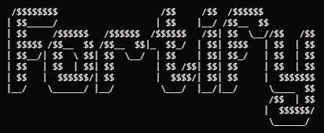
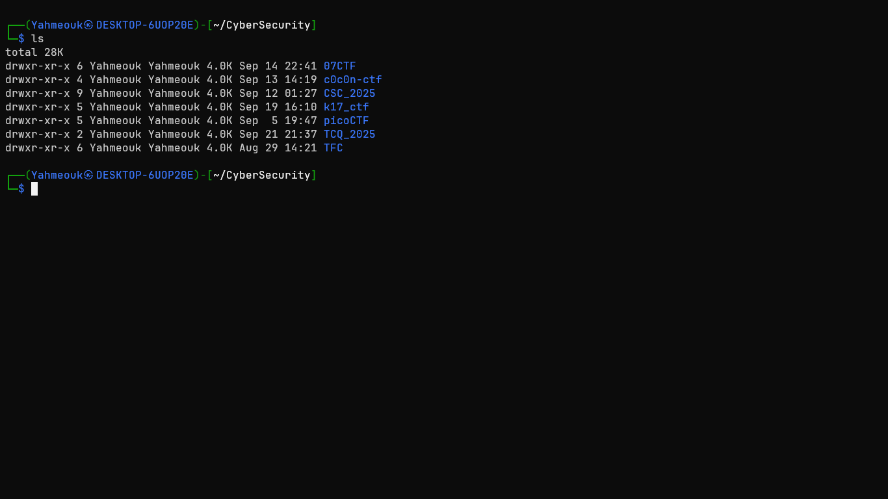
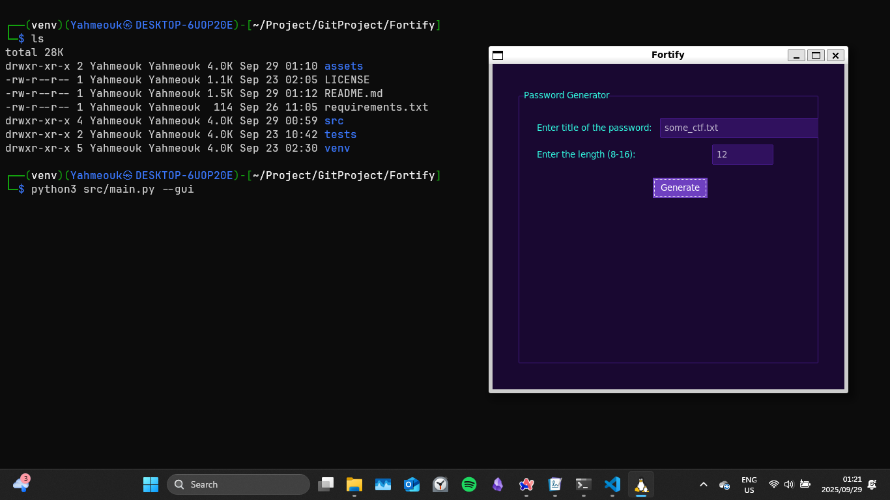
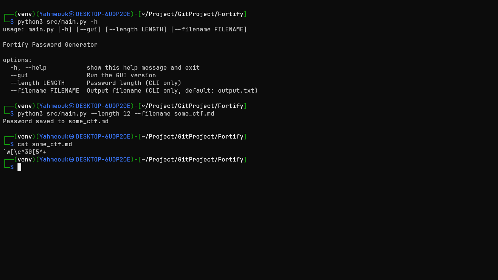

# Fortify



## Description

Fortify is a command-line and GUI password generator to help you create strong, secure passwords for safe cyberspace practices. It is written in Python and leverages several easy-to-use modules.
I was forced to (kind of by situation) create this project because I have been focused on playing CTFs lately and I have been struggling a lot to come up with different passwords for different CTFs. This will make it easier for me(and anybody who will use this) to save passwords in the directory of their choice on a file.



## Features

- Generate strong passwords with customizable length
- Choose between command-line and GUI modes
- Automatically saves passwords to a file (with auto-incremented filenames)
- Copies generated passwords to your clipboard

## Installation

1. Clone the repository:

   ```sh
   git clone https://github.com/INNOCENT-ops806/Fortify.git
   cd Fortify
   ```

2. Install dependencies:

   ```sh
   pip install -r requirements.txt
   ```

## Usage

### Command-Line (default)

```sh
python src/main.py --length 12 --filename mypass.txt
```

- `--length`: Password length (default: 10)
- `--filename`: Output filename (default: output.txt, auto-increments if exists)

### GUI

```sh
python src/main.py --gui
```

## Images

#### Using the GUI



### Using the CLI(recommended)



## License

MIT License
The project is Licensed under MIT License feel free to edit in any way that you want
